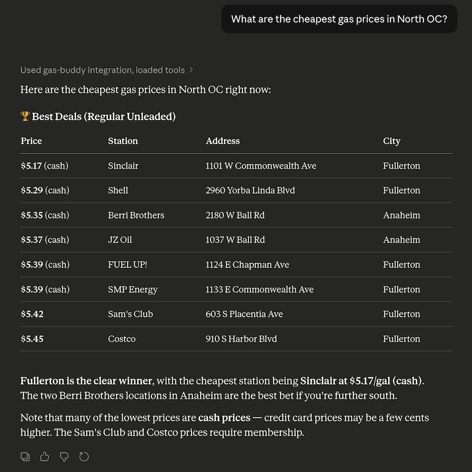

# GasBuddy MCP Price Tracker

[](https://safeskill.dev/scan/jimmytwei-gasbuddy-mcp-price-tracker)
The GasBuddy MCP Price Tracker is a Model Context Protocol (MCP) server that scrapes real-time gas prices on [gasbuddy.com](https://www.gasbuddy.com/) using Playwright. It finds the cheapest fuel in any US city or zip code.

> [!NOTE]
> This project is for educational purposes only. GasBuddy reserves the right to modify their website structure at any time, which may break this script. The author provides no guarantee of functionality and is not liable for issues arising from its use. Community contributions and fixes are highly encouraged.

## Requirements
- Python 3.10+
- Playwright
- Playwright-Stealth
- FastMCP

## Installation & Setup

1. Clone the repository and navigate to the project directory.

2. Create and activate a virtual environment.
   # macOS/Linux
   ```bash
   python3 -m venv venv
   source venv/bin/activate
   ```
   # Windows
   ```cmd
   python -m venv venv
   .\venv\Scripts\activate
   ```
3. Install dependencies:
   `pip install -r requirements.txt`

4. Install browser binaries:
   `playwright install chromium`

5. Test the standalone tool (CLI):
   `python gas_tool.py`

## Setup in Claude Desktop

To allow Claude Desktop to interact with the MCP server to get the cheapest gas prices, you will need to update your claude_desktop_config.json file and replace `{absolute_path_to}` with the absolute path to the cloned repository folder.

```json
{
  "mcpServers": {
    "gas-buddy": {
      "command": "/{absolute_path_to}/venv/bin/python",
      "args": ["/{absolute_path_to}/gas_server.py"]
    }
  }
}
```

### Example in Claude


## License
This application is distributed under the [MIT License](LICENSE).
